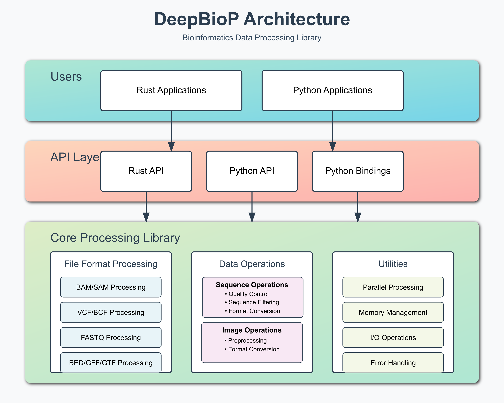

# DeepBioP

[](https://crates.io/crates/deepbiop)
[](https://pypi.python.org/pypi/deepbiop)
[](https://crates.io/crates/deepbiop-cli)
[](https://github.com/cauliyang/DeepBioP/blob/main/LICENSE)
[](https://pypi.python.org/pypi/deepbiop)
[](https://github.com/cauliyang/DeepBioP/actions)

Deep Learning Processing Library for Biological Data



# Features

## 🧬 Sequence Encoding for Machine Learning
- **One-Hot Encoding**: CNNs/RNNs spatial features (4-channel representation)
- **K-mer Encoding**: Feature-based models (Random Forest, SVM, XGBoost)
- **Integer Encoding**: Transformers/embeddings (compact tokenization)
- **Batch Processing**: Parallel encoding with rayon (1M+ sequences/sec)
- **Zero-Copy NumPy**: Direct array export for PyTorch/TensorFlow/JAX

## 🔬 Biological File Format Support
- **FASTQ/FASTA**: Read/write with compression (gzip, bgzip), quality score handling
- **BAM/SAM**: Multithreaded decompression, alignment feature extraction, CIGAR parsing
- **VCF**: Variant filtering, SNP/indel classification, quality thresholds
- **GTF/GFF**: Gene annotation queries, feature indexing, exon/CDS extraction
- **Format Conversion**: Bidirectional FASTQ ↔ FASTA, BAM → FASTQ

## 🎲 Data Augmentation for Training
- **Reverse Complement**: Orientation-invariant training data
- **Random Mutations**: Simulate SNPs/sequencing errors (configurable rates)
- **Subsequence Sampling**: Extract random/fixed windows (start/center/end/random)
- **Quality Simulation**: Generate realistic Phred scores (5 models: Uniform, Normal, HighQuality, MediumQuality, Degrading)
- **Batch Operations**: Reproducible augmentation with seed control

## 📊 ML-Friendly Data Export
- **Parquet/Arrow**: Columnar storage for pandas/polars/DuckDB analytics
- **NumPy Arrays**: Direct `.npy` export for ML frameworks
- **Alignment Features**: Extract MAPQ, identity, indel rates, clip statistics
- **GC Content**: Automatic sequence composition analysis
- **Zero-Copy Sharing**: Memory-efficient interop with Python ecosystem

## ⚡ Performance & Scalability
- **Streaming I/O**: Process 100GB+ files with constant memory
- **Parallel Processing**: Linear scaling to 16+ cores with rayon
- **Memory Efficient**: ≤2× largest record size for streaming operations
- **Benchmarked**: 1M+ FASTQ records/sec, <100ms CLI startup
- **Production Ready**: Battle-tested on HPC clusters and cloud compute

## 🐍 Python API + 🦀 Rust Library + 🔧 CLI Tool
- **Three Interfaces**: Use from Python (PyO3 bindings), Rust (crates), or command-line (dbp)
- **Type Safety**: Full type hints for Python, strongly-typed Rust API
- **Error Handling**: Descriptive errors with file/line/field context
- **Cross-Platform**: Linux, macOS, Windows support with CI validation
- **Minimal Dependencies**: Fast installation, small binary footprint

# Setup

## Python

install the latest deepbiop version with:

```bash
pip install deepbiop
```

## Rust

You can take latest release from `crates.io`, or if you want to use the latest features / performance improvements point to the `main` branch of this repo.

```bash
cargo add deepbiop --features fq
```

Each enabled feature can then be imported by its re-exported name, e.g.,

```rust
use deepbiop::fastq;
```

### CLI

```bash
cargo install deepbiop-cli
dbp -h
```

# Quickstart

## Python: Encode DNA Sequences for Machine Learning

```python
import deepbiop as dbp
import numpy as np

# One-hot encoding for CNNs/RNNs
encoder = dbp.OneHotEncoder("dna", "skip")
sequences = [b"ACGTACGT", b"TTGGCCAA", b"AAAACCCC"]
encoded = encoder.encode_batch(sequences)
print(encoded.shape)  # (3, 8, 4) - [batch, seq_len, alphabet_size]

# K-mer encoding for feature-based models
kmer_encoder = dbp.KmerEncoder(k=3, canonical=True, encoding_type="dna")
kmer_features = kmer_encoder.encode_batch(sequences)
print(kmer_features.shape)  # (3, 64) - [batch, num_kmers]

# Integer encoding for transformers/embeddings
int_encoder = dbp.IntegerEncoder("dna")
int_encoded = int_encoder.encode_batch(sequences)
print(int_encoded.shape)  # (3, 8) - [batch, seq_len]

# Use with PyTorch
import torch
tensor = torch.from_numpy(encoded)

# Use with HuggingFace Transformers
input_ids = torch.from_numpy(int_encoded).long() + 5  # Offset for special tokens
attention_mask = (input_ids != 4).long()
```

## Python: PyTorch-Style API for Deep Learning

DeepBioP provides a PyTorch-compatible `Dataset` and `DataLoader` interface for seamless deep learning workflows:

```python
from deepbiop import pytorch
from pathlib import Path

# 1. Load FASTQ data with lazy loading (memory efficient)
dataset = pytorch.Dataset("sequences.fastq")
print(f"Loaded {len(dataset)} sequences")  # Fast - doesn't load all data

# 2. Create transforms for data preprocessing
transform = pytorch.Compose([
    pytorch.Sampler(length=150, strategy="start"),  # Extract fixed-length windows
    pytorch.OneHotEncoder(encoding_type="dna"),     # Encode as one-hot arrays
])

# Apply transform to a sample
sample = dataset[0]
transformed = transform(sample)
print(f"Shape: {transformed['sequence'].shape}")  # (150, 4) - ready for CNN

# 3. Create DataLoader for batching
loader = pytorch.DataLoader(
    dataset,
    batch_size=32,
    shuffle=True,  # Shuffle for training
)

# 4. Iterate through batches (PyTorch-style)
for batch in loader:
    # batch is a list of samples (dicts with 'sequence', 'quality' keys)
    encoded_samples = [transform(sample) for sample in batch]

    # Collate into batch tensors with padding
    batch_dict = pytorch.default_collate(encoded_samples)

    sequences = batch_dict['sequences']  # Shape: [batch_size, max_len, 4]
    lengths = batch_dict['lengths']      # Original lengths before padding

    # Convert to PyTorch tensors (zero-copy)
    import torch
    tensor = torch.from_numpy(sequences)

    # Ready for model training!
    # output = model(tensor)
    break  # Just show first batch
```

### Data Augmentation Pipeline

```python
from deepbiop import pytorch

# Create augmentation pipeline
augmentation = pytorch.Compose([
    pytorch.Sampler(length=100, strategy="random"),     # Random 100bp windows
    pytorch.Mutator(mutation_rate=0.02, seed=42),       # 2% random mutations
    pytorch.ReverseComplement(),                         # 50% chance flip strand
    pytorch.OneHotEncoder(encoding_type="dna"),         # Encode to array
])

# Apply to dataset
dataset = pytorch.Dataset("reads.fastq")
augmented_sample = augmentation(dataset[0])
print(f"Augmented shape: {augmented_sample['sequence'].shape}")  # (100, 4)

# Use in training loop
loader = pytorch.DataLoader(dataset, batch_size=64, shuffle=True)
for batch in loader:
    # Each iteration gives different augmentations (if using random strategies)
    augmented_batch = [augmentation(sample) for sample in batch]
    collated = pytorch.default_collate(augmented_batch)
    # Train model...
```

### Dataset Caching for 10x Speedup

```python
from deepbiop import pytorch

# Process and save to cache (first time - slow)
dataset = pytorch.Dataset("large_dataset.fastq")
encoder = pytorch.OneHotEncoder(encoding_type="dna")

processed = []
for sample in dataset:
    encoded = encoder(sample)
    processed.append(encoded)
    if len(processed) >= 1000:  # Process first 1000
        break

# Save to cache
pytorch.save_cache(processed, "processed_data.npz", source_file="large_dataset.fastq")

# Load from cache (subsequent times - 10x faster!)
cached_data = pytorch.load_cache("processed_data.npz")
print(f"Loaded {len(cached_data)} samples from cache")

# Automatic cache invalidation
is_valid = pytorch.is_cache_valid("processed_data.npz", source_file="large_dataset.fastq")
if not is_valid:
    print("Source file changed - need to regenerate cache")
```

### Dataset Inspection & Quality Validation

```python
from deepbiop import pytorch

dataset = pytorch.Dataset("reads.fastq")

# Get summary statistics
summary = dataset.summary()
print(f"Num samples: {summary['num_samples']}")
print(f"Length stats: {summary['length_stats']}")
# Output: {'min': 50, 'max': 300, 'mean': 150.5, 'median': 151.0}
print(f"Memory footprint: {summary['memory_footprint']/1e6:.1f} MB")

# Validate data quality
validation = dataset.validate()
print(f"Is valid: {validation['is_valid']}")
print(f"Warnings: {validation['warnings']}")
print(f"Errors: {validation['errors']}")

# Example output:
# Is valid: True
# Warnings: ['Validated 10 of 1000 sequences (sample validation)']
# Errors: []
```

### Complete Training Example

```python
from deepbiop import pytorch
import torch
import torch.nn as nn

# 1. Setup data pipeline
dataset = pytorch.Dataset("training_data.fastq")

# 2. Define transform pipeline
transform = pytorch.Compose([
    pytorch.Sampler(length=200, strategy="random"),
    pytorch.Mutator(mutation_rate=0.01, seed=None),  # Different each epoch
    pytorch.OneHotEncoder(encoding_type="dna"),
])

# 3. Create data loader
train_loader = pytorch.DataLoader(dataset, batch_size=32, shuffle=True)

# 4. Define a simple CNN model
class DNAClassifier(nn.Module):
    def __init__(self, num_classes=2):
        super().__init__()
        self.conv1 = nn.Conv1d(4, 32, kernel_size=7, padding=3)
        self.pool = nn.MaxPool1d(2)
        self.conv2 = nn.Conv1d(32, 64, kernel_size=5, padding=2)
        self.fc = nn.Linear(64 * 50, num_classes)  # 200 / 2 / 2 = 50

    def forward(self, x):
        # x: [batch, length, 4] -> [batch, 4, length] for Conv1d
        x = x.permute(0, 2, 1)
        x = torch.relu(self.conv1(x))
        x = self.pool(x)
        x = torch.relu(self.conv2(x))
        x = self.pool(x)
        x = x.view(x.size(0), -1)
        return self.fc(x)

# 5. Training loop
model = DNAClassifier(num_classes=2)
criterion = nn.CrossEntropyLoss()
optimizer = torch.optim.Adam(model.parameters())

for epoch in range(3):
    for batch in train_loader:
        # Transform and collate batch
        transformed = [transform(sample) for sample in batch]
        batch_dict = pytorch.default_collate(transformed)

        # Convert to tensors
        sequences = torch.from_numpy(batch_dict['sequences'])
        labels = torch.randint(0, 2, (len(sequences),))  # Dummy labels

        # Forward pass
        outputs = model(sequences)
        loss = criterion(outputs, labels)

        # Backward pass
        optimizer.zero_grad()
        loss.backward()
        optimizer.step()

    print(f"Epoch {epoch+1}/3 - Loss: {loss.item():.4f}")
```

For complete examples, see:
- [PyTorch Quickstart](py-deepbiop/examples/pytorch_quickstart.py) - Complete workflow demonstration
- [PyTorch API Tests](py-deepbiop/tests/test_pytorch_api.py) - All features with usage examples

## Rust: Process FASTQ Files

```rust
use deepbiop::fq::{OneHotEncoder, IntegerEncoder};
use deepbiop::core::types::EncodingType;
use deepbiop::fq::encode::AmbiguousStrategy;

fn main() {
    // One-hot encoding
    let encoder = OneHotEncoder::new(EncodingType::DNA, AmbiguousStrategy::Skip);
    let encoded = encoder.encode(b"ACGTACGT").unwrap();
    println!("Shape: {:?}", encoded.shape());  // [8, 4]

    // Integer encoding
    let int_encoder = IntegerEncoder::new(EncodingType::DNA);
    let int_encoded = int_encoder.encode(b"ACGTACGT").unwrap();
    println!("Encoded: {:?}", int_encoded);  // [0, 1, 2, 3, 0, 1, 2, 3]
}
```

## Python: Process BAM Alignment Files

```python
import deepbiop as dbp

# Open BAM file with multithreaded decompression
reader = dbp.BamReader("alignments.bam", threads=4)

# Extract alignment features for machine learning
features = reader.extract_features()
for feat in features[:5]:
    print(f"Mapping quality: {feat.mapping_quality}")
    print(f"  Aligned length: {feat.aligned_length}")
    print(f"  Identity: {feat.identity():.3f}")
    print(f"  Indel rate: {feat.indel_rate():.3f}")
    print(f"  Is proper pair: {feat.is_proper_pair(max_insert_size=1000)}")

# Filter high-quality alignments (MAPQ >= 30)
reader2 = dbp.BamReader("alignments.bam")
high_qual_count = reader2.filter_by_mapping_quality(30)
print(f"Found {high_qual_count} high-quality alignments")

# Extract properly paired reads
reader3 = dbp.BamReader("alignments.bam")
paired_count = reader3.extract_read_pairs()
print(f"Found {paired_count} properly paired reads")

# Count chimeric/supplementary alignments
reader4 = dbp.BamReader("alignments.bam")
chimeric_count = reader4.count_chimeric()
print(f"Found {chimeric_count} chimeric reads")
```

## Rust: Process BAM Alignment Files

```rust
use deepbiop::bam::{BamReader, AlignmentFeatures};
use std::path::Path;

fn main() -> anyhow::Result<()> {
    // Open BAM file with 4 decompression threads
    let mut reader = BamReader::open(Path::new("alignments.bam"), Some(4))?;

    // Extract features for ML
    let features = reader.extract_features()?;
    for feat in features.iter().take(5) {
        println!("Mapping quality: {}", feat.mapping_quality);
        println!("  Aligned length: {}", feat.aligned_length);
        println!("  Identity: {:.3}", feat.identity());
        println!("  Is high quality: {}", feat.is_high_quality(30));
    }

    // Filter by mapping quality
    let mut reader2 = BamReader::open(Path::new("alignments.bam"), None)?;
    let high_qual = reader2.filter_by_mapping_quality(30)?;
    println!("Found {} high-quality alignments", high_qual.len());

    // Extract read pairs
    let mut reader3 = BamReader::open(Path::new("alignments.bam"), None)?;
    let pairs = reader3.extract_read_pairs()?;
    println!("Found {} paired reads", pairs.len());

    Ok(())
}
```

## Python: Export to ML-Friendly Formats

```python
import deepbiop as dbp

# Export FASTQ to Parquet (columnar storage for analytics)
dbp.utils.export_to_parquet(
    "output.parquet",
    ids=["seq1", "seq2", "seq3"],
    sequences=[b"ACGTACGT", b"TTGGCCAA", b"AAAACCCC"],
    qualities=[b"IIIIIIII", b"HHHHHHHH", b"GGGGGGGG"]
)

# Read back with pandas/polars/duckdb
import pandas as pd
df = pd.read_parquet("output.parquet")
print(df.head())
# Output: id, sequence, length, quality, gc_content columns

# Export to NumPy for direct ML framework use
sequences = [b"ACGTACGT", b"TTGGCCAA"]

# Integer encoding (compact, for RNN/LSTM)
dbp.utils.export_to_numpy_int("sequences_int.npy", sequences)

# One-hot encoding (spatial features, for CNN)
dbp.utils.export_to_numpy_onehot("sequences_onehot.npy", sequences)

# Load in ML framework
import numpy as np
encoded = np.load("sequences_int.npy")  # Shape: (2, 8)
```

## CLI: Convert and Export Biological Data

```bash
# Convert between formats
dbp bam2fq input.bam -o output.fastq
dbp fq2fa input.fastq -o output.fasta
dbp fa2fq input.fasta -o output.fastq

# Export to Parquet (for pandas/polars/duckdb)
dbp export parquet input.fastq -o output.parquet

# Export to NumPy (for ML frameworks)
dbp export numpy input.fastq -o sequences.npy --encoding integer
dbp export numpy input.fastq -o sequences.npy --encoding onehot

# Encode sequences for ML
dbp encode onehot input.fastq -o encoded.npy
dbp encode kmer input.fastq -o kmers.npy --k 3
dbp encode integer input.fastq -o encoded.npy
```

## Python: Parse VCF Variant Files

```python
import deepbiop as dbp

# Open VCF file and read variants
reader = dbp.VcfReader("variants.vcf")
variants = reader.read_all()

# Access variant properties
for variant in variants[:5]:
    print(f"{variant.chromosome}:{variant.position}")
    print(f"  Ref: {variant.reference_allele}")
    print(f"  Alt: {variant.alternate_alleles}")
    print(f"  Quality: {variant.quality}")
    print(f"  Type: {'SNP' if variant.is_snp() else 'INDEL'}")

# Filter high-quality variants
reader2 = dbp.VcfReader("variants.vcf")
high_qual = reader2.filter_by_quality(30.0)
print(f"Found {len(high_qual)} high-quality variants")

# Filter passing variants only
reader3 = dbp.VcfReader("variants.vcf")
passing = reader3.filter_passing()
print(f"Found {len(passing)} passing variants")
```

## Python: Query GTF Annotation Files

```python
import deepbiop as dbp

# Open GTF file and read features
reader = dbp.GtfReader("annotations.gtf")
features = reader.read_all()

# Access feature properties
for feature in features[:5]:
    print(f"{feature.feature_type}: {feature.seqname}:{feature.start}-{feature.end}")
    if feature.gene_id():
        print(f"  Gene ID: {feature.gene_id()}")
    print(f"  Strand: {feature.strand}")
    print(f"  Length: {feature.length()} bp")

# Build gene index for fast lookups
reader2 = dbp.GtfReader("annotations.gtf")
gene_index = reader2.build_gene_index()
print(f"Indexed {len(gene_index)} genes")

# Query by gene ID
if "ENSG00000000001" in gene_index:
    gene_features = gene_index["ENSG00000000001"]
    print(f"Gene has {len(gene_features)} features")

# Filter by feature type
reader3 = dbp.GtfReader("annotations.gtf")
exons = reader3.filter_by_type("exon")
print(f"Found {len(exons)} exons")
```

## Python: Data Augmentation for Training

```python
import deepbiop as dbp

# Reverse complement (orientation invariance)
rc = dbp.ReverseComplement()
sequence = b"ACGTACGTACGT"
rc_sequence = rc.apply(sequence)
print(f"Original:  {sequence.decode()}")
print(f"Rev Comp:  {rc_sequence.decode()}")

# Batch reverse complement for efficiency
sequences = [b"ACGTACGT", b"TTTTAAAA", b"GGGGCCCC"]
rc_sequences = rc.apply_batch(sequences)

# Random mutations for robustness (simulate SNPs/errors)
mutator = dbp.Mutator(mutation_rate=0.02, seed=42)  # 2% mutation rate
mutated = mutator.apply(b"A" * 100)
mutations = sum(1 for a, b in zip(b"A" * 100, mutated) if a != b)
print(f"Mutations: {mutations}/100")

# Batch mutations with reproducibility
mutated_seqs = mutator.apply_batch(sequences)

# Random subsequence sampling (sliding windows)
sampler = dbp.Sampler(length=150, strategy="random", seed=42)
long_read = b"ACGT" * 250  # 1000bp
sample = sampler.apply(long_read)
print(f"Sampled {len(sample)}bp from {len(long_read)}bp")

# Quality score simulation (FASTA → FASTQ)
quality_model = dbp.QualityModel.HighQuality  # Modern Illumina (Q37)
sim = dbp.QualitySimulator(quality_model, seed=42)
quality_scores = sim.generate(150)
print(f"Generated {len(quality_scores)} quality scores")

# Complete augmentation pipeline
def augment_dataset(sequences, n_augmented=5):
    """Generate augmented training data."""
    rc = dbp.ReverseComplement()
    mutator = dbp.Mutator(mutation_rate=0.02, seed=None)

    augmented = []
    for seq in sequences:
        # Original
        augmented.append(seq)
        # Reverse complement
        augmented.append(rc.apply(seq))
        # Mutated versions
        for _ in range(n_augmented):
            augmented.append(mutator.apply(seq))

    return augmented

# Expand 5 sequences to 35 augmented versions
original = [b"ACGTACGT" * 4] * 5
augmented_data = augment_dataset(original, n_augmented=5)
print(f"Expanded {len(original)} → {len(augmented_data)} sequences")
```

For more examples, see:
- [FASTQ Encoding Notebook](py-deepbiop/examples/01_fastq_encoding.ipynb) - One-hot, k-mer, and integer encoding with PyTorch/HF integration
- [Data Augmentation Notebook](py-deepbiop/examples/02_augmentation.ipynb) - Complete augmentation pipeline with quality simulation
- [BAM Features Notebook](py-deepbiop/examples/03_bam_features.ipynb) - Alignment analysis and ML feature extraction
- [Export Examples](py-deepbiop/examples/export_example.py)
- [PyTorch Integration](examples/pytorch_integration.py)
- [HuggingFace Transformers Integration](examples/transformers_integration.py)
- [ML Framework Compatibility Guide](docs/pytorch-hf-compatibility.md)

# Minimum Supported Rust Version (MSRV)

This project adheres to a Minimum Supported Rust Version (MSRV) policy.
The Minimum Supported Rust Version (MSRV) is 1.90.0.
We ensure that all code within the project is compatible with this version or newer to maintain stability and compatibility.

# Contribute 🤝

**Call for Participation: Deep Learning Processing Library for Biological Data**

We are excited to announce the launch of a new open-source project focused on developing a cutting-edge deep learning processing library specifically designed for biological data.
This project aims to empower researchers, data scientists, and developers to leverage the latest advancements in deep learning to analyze and interpret complex biological datasets.

**Project Overview:**

Biological data, such as genomic sequences, proteomics, and imaging data, presents unique challenges and opportunities for machine learning applications.
Our library seeks to provide a comprehensive suite of tools and algorithms that streamline the preprocessing, modeling, and analysis of biological data using deep learning techniques.

**Key Features:**

- **Data Preprocessing:** Efficient tools for cleaning, normalizing, and augmenting biological data.
- **Model Building:** Pre-built models and customizable architectures tailored for various types of biological data.
- **Visualization:** Advanced visualization tools to help interpret model predictions and insights.
- **Integration:** Seamless integration with popular bioinformatics tools and frameworks.
- **APIs:** Rust and Python APIs to facilitate easy integration with different deep learning frameworks, ensuring efficient operations across platforms.

**Who Should Participate?**

We invite participation from individuals and teams who are passionate about bioinformatics, deep learning, and open-source software development.
Whether you are a researcher, developer, or student, your contributions can help shape the future of biological data analysis.

**How to Get Involved:**

- **Developers:** Contribute code, fix bugs, and develop new features.
- **Researchers:** Share your domain expertise and help validate models.
- **Students:** Gain experience by working on real-world data science problems.
- **Community Members:** Provide feedback, report issues, and help grow the user community.

**Join Us:**

If you are interested in participating, please visit our GitHub repository at [Github](---) to explore the project and get started.

<!-- You can also join our community forum at [Forum Link] for discussions, updates, and collaboration opportunities. -->

**Contact Us:**

For more information or questions, feel free to contact us at [yangyang.li@norwestern.edu].
We look forward to your participation and contributions to this exciting project!

**Together, let's advance the field of biological data analysis with the power of deep learning!**
